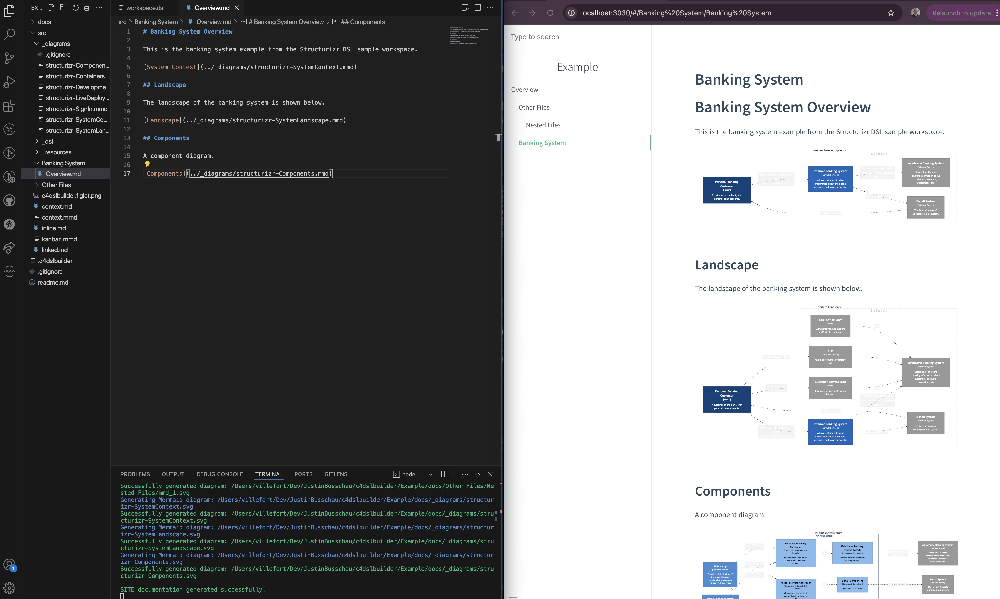

# **C4BUILDER**

**C4-DSL-Builder is a lightweight nodejs cli tool for building, maintaining and sharing a software architecture project using a combination of code and Markdown.**

[GitHub](https://github.com/justinbusschau/C4-DSL-Builder)
[Overview](#overview)

