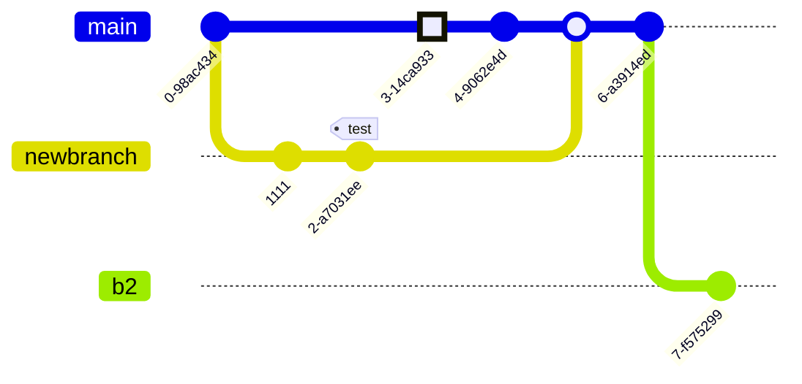

# Description

The mermaid `gitGraph` below is included to show how inline mermaid files in nested sub-folders are handled.

```mermaid
gitGraph:
    commit "Ashish"
    branch newbranch
    checkout newbranch
    commit id:"1111"
    commit tag:"test"
    checkout main
    commit type: HIGHLIGHT
    commit
    merge newbranch
    commit
    branch b2
    commit

```

## Linked files

[linked text file](linked.txt)