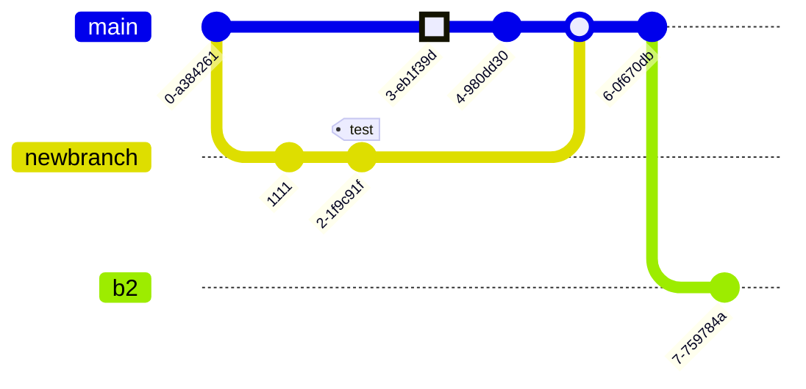

# Description

This MD file is nested in a subfolder and it exists mainly to show how the `--split` option affects rendered output.

The mermaid `gitGraph` below is included to show how inline mermaid files in nested sub-folders are handled.

## Linked files

[linked text file](linked.txt)