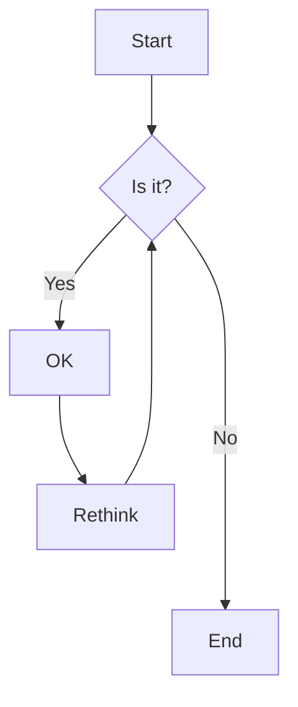

## Inline diagrams

You can also include your mermaid diagrams in code blocks (wit appropriate language identifier) and these will render as expected.

```mermaid
flowchart TD
    A[Start] --> B{Is it?}
    B -->|Yes| C[OK]
    C --> D[Rethink]
    D --> B
    B ---->|No| E[End]
```
